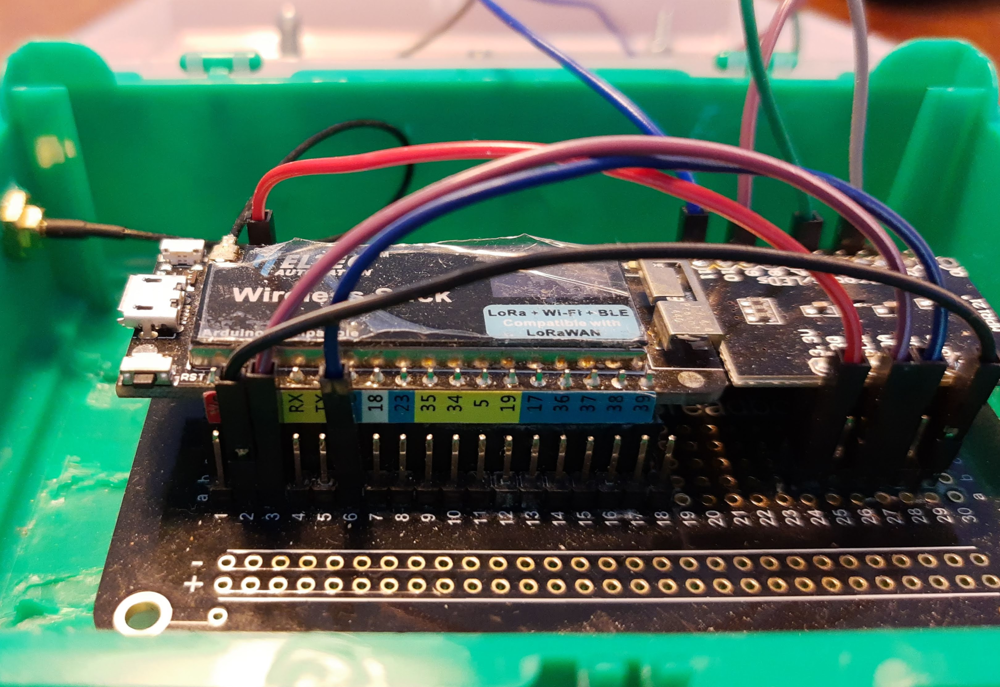

# transceiver-remote

This is a sketch for a esp32 to build a remote control that can 
send and receive mqtt messages.
The Esp32 connects to your wireless network and connects to your mqtt server. 

Functions:
 - connect to your wifi
 - connect to your mqtt server
 - can publish mqtt messages 
 - can subscribe to mqtt topics
 - on a triggered GPIO sends a mqtt message (optional - set GPIOREMOTE)
 - sets a GPIO if a subscribed mqtt message arrived (optional - set GPIOREMOTE)
 - use a Adafruit MPR121 for touch input to a send mqtt message (optional - set MPR121)
 - OTA (Over the air) updates (optional - set OTA)

Tested with nodeMCU, Adafruit Feather ESP32 and Heltec Wireless Stick

## incoming mqtt
The mqtt_callback function is used to handle incoming mqtt messages.

Don't forget to set the subscribed topics in the reconnect function.

## MPR121

connecting

In loop you can define the actions for the MPR121

## GPIO based switches

## switch a GPIO on a mqtt message

|   |   |   |
|---|---|---|
| GPIO 13 | works | Heltec Wireless Stick |
| GPIO 36 | works | Heltec Wireless Stick |
| GPIO 37 | works | Heltec Wireless Stick |
| GPIO 38 | works | Heltec Wireless Stick |
| GPIO 39 | works | Heltec Wireless Stick |
| GPIO 23 | works | Heltec Wireless Stick |

## connetcing a Adafruit MPR121

## future plans

add LORA
